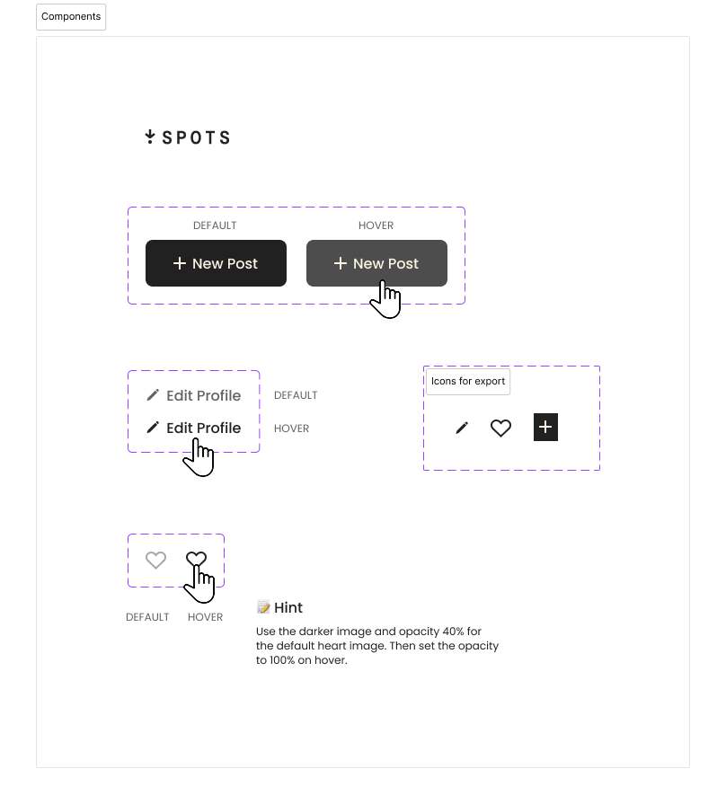

# Spots

  Spot is a website where users can share and post images.

## Description

  This website allow the user to edit the avatar and shate pictures of their likes. Also let other users share which pcitures they like. It also is an adaptable website that adapts to differents types of devices. 

### Tech Stack
  
  - html
  - css
  - grid 
  - responsive website
  - interactive website

#### Images

  
  
  
  
  .jpg)

##### Deployment

  This webpage is deployed in GitHub pages.
    - Deployment link: https://github.com/micdan8463-cell/se_project_spots

##### Project Pitch Video

    Check out [this video](https://www.loom.com/share/b23ba0b43e874f408452999e4cd3c389), where I describe my project and some challenges I faced while building it.
